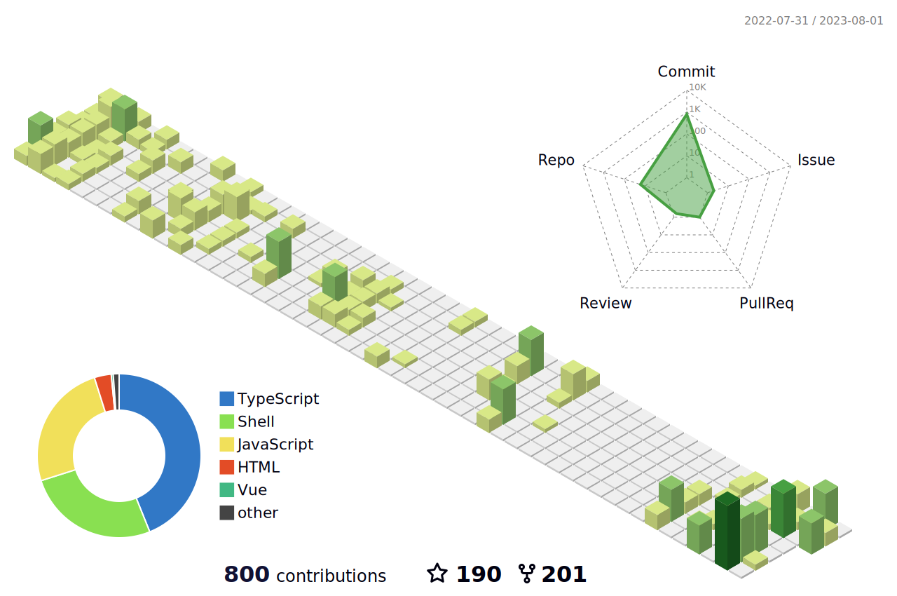

## 🧑‍💻 About Me

- 🔭 Full-stack developer with **9+ years** of experience
- 🌱 Currently focused on **Go**, **React**, **TypeScript**, and **Cloud Native**
- 💬 Ask me about Web Development, DevOps, or Blockchain
- 📫 Reach me at **draco.coder@gmail.com**

## 🛠️ Tech Stack

<table>
  <tr>
    <td align="center" width="110"><b>Languages</b></td>
    <td>
      
      
      
      
      
    </td>
  </tr>
  <tr>
    <td align="center"><b>Frontend</b></td>
    <td>
      
      
      
      
      
    </td>
  </tr>
  <tr>
    <td align="center"><b>Backend</b></td>
    <td>
      
      
      
      
      
      
    </td>
  </tr>
</table>

## 📊 GitHub Stats

  

## 🏔️ 3D Contribution

<picture>
  
</picture>

## 📈 Metrics

<picture>
  
</picture>

---

